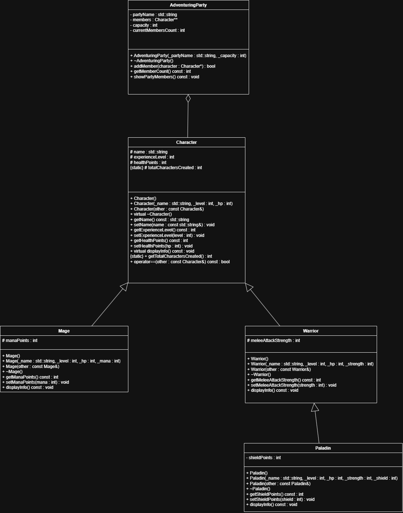

# Laboratorio 3 - Sistema RPG en C++

## Integrantes
- Enoc Garro
- Raúl

## Lista de Autoevaluación

| # | Requisito | ¿Lo hizo? |
|---|---|---|
| 1 | Identificaron 5 clases con jerarquía de herencia de 3 niveles (padre–hija–nieta) | **Sí** |
| 2 | Atributos privados con getters const en todas las clases | **Sí** |
| 3 | Constructor parametrizado y constructor de copia en la clase base | **Sí** |
| 4 | Constructores de las clases derivadas invocan el constructor del padre | **Sí** |
| 5 | Miembro static con contador total + método de acceso | **Sí** |
| 6 | Sobrecarga de \operator==\ | **Sí** |
| 7 | Diagrama UML entregado y coherente con el código | **Sí** |
| 8 | \main\ que demuestra todo lo anterior, usando las 5 clases | **Sí** |
| 9 | El programa compila y corre sin errores | **Sí** |
| 10 | *(Opcional)* Segunda línea de herencia de 3 niveles | **No** |
| 11 | Ambos integrantes tienen commits en el repositorio | **Sí** |

## Diagrama UML

